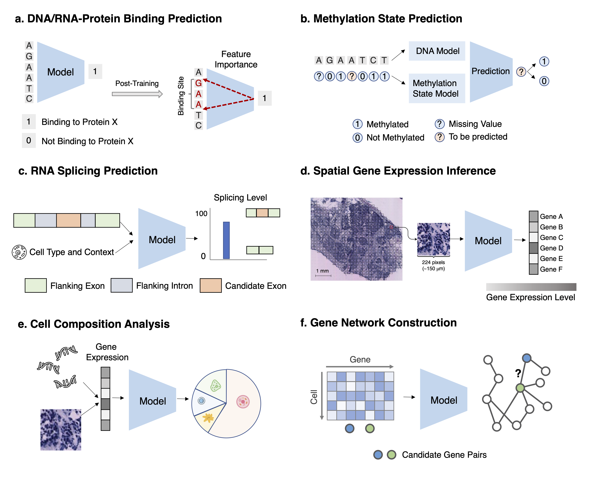
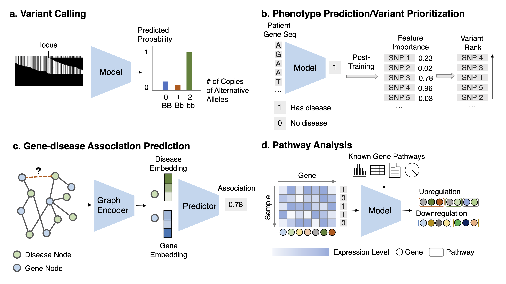
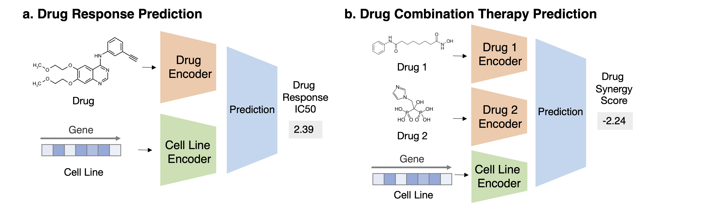
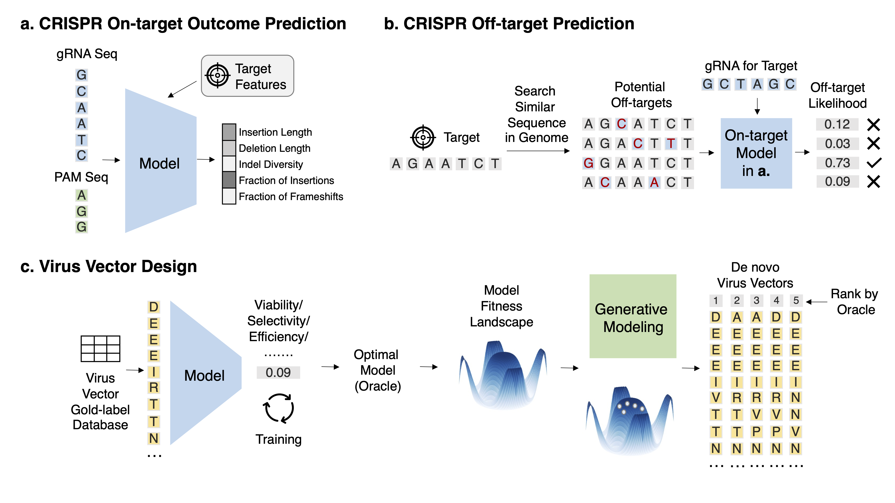
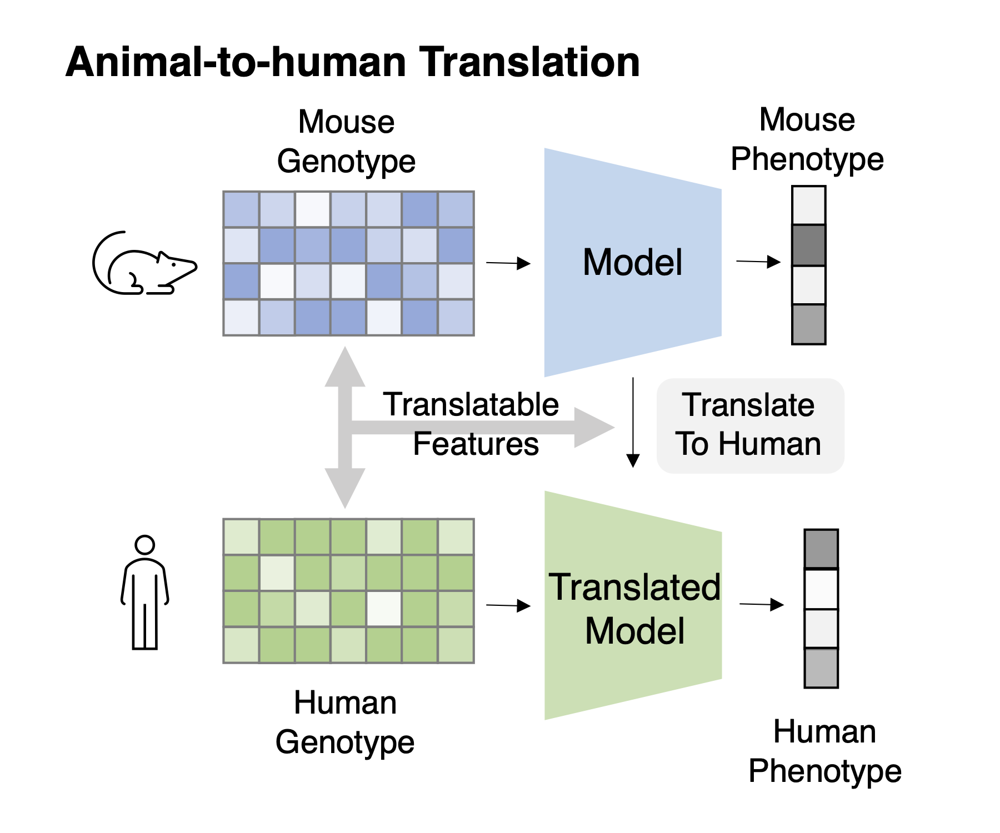
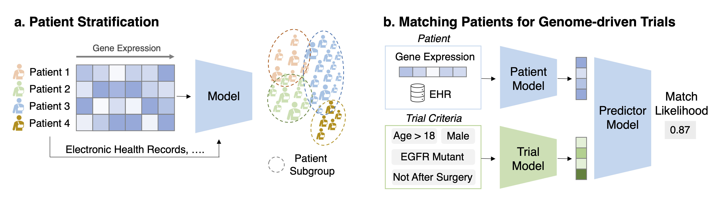
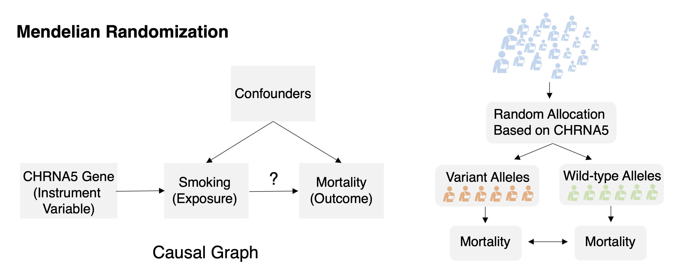
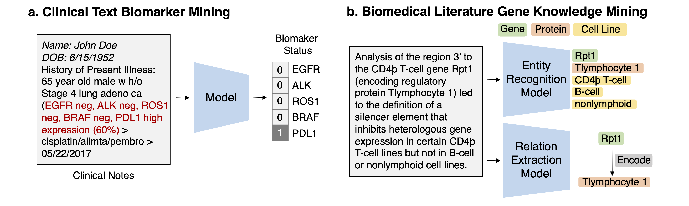

# Machine Learning for Genomics and Therapeutics Resources

This repo accompanies our survey paper: 

[Machine Learning Applications for Therapeutic Tasks with Genomics Data](https://arxiv.org/abs/2105.01171).
*Kexin Huang, Cao Xiao, Lucas M. Glass, Cathy W. Critchlow, Greg Gibson, Jimeng Sun*

We list tools, algorithms, data for this area. Feel free to make a pull request for new resources.

---- 

# Table of Contents

- [Machine Learning for Genomics and Therapeutics Resources](#machine-learning-for-genomics-and-therapeutics-resources)
  * [Machine Learning for Genomics in Target Discovery](#machine-learning-for-genomics-in-target-discovery)
    + [Theme 1: Facilitating Understanding of Human Biology](#theme-1--facilitating-understanding-of-human-biology)
      - [Task 1: DNA-protein and RNA-protein binding prediction](#task-1--dna-protein-and-rna-protein-binding-prediction)
      - [Task 2: Methylation state prediction](#task-2--methylation-state-prediction)
      - [Task 3: RNA splicing prediction](#task-3--rna-splicing-prediction)
      - [Task 4: Spatial gene expression inference](#task-4--spatial-gene-expression-inference)
      - [Task 5: Cell composition analysis](#task-5--cell-composition-analysis)
      - [Task 6: Gene network construction](#task-6--gene-network-construction)
    + [Theme 2: Identifying Druggable Biomarkers](#theme-2--identifying-druggable-biomarkers)
      - [Task 1: Variant calling](#task-1--variant-calling)
      - [Task 2: Variant pathogenicity prioritization](#task-2--variant-pathogenicity-prioritization)
      - [Task 3: Rare disease detection](#task-3--rare-disease-detection)
      - [Task 4: Gene-disease association prediction](#task-4--gene-disease-association-prediction)
      - [Task 5: Pathway analysis and prediction](#task-5--pathway-analysis-and-prediction)
  * [Machine Learning for Genomics in Therapeutics Discovery](#machine-learning-for-genomics-in-therapeutics-discovery)
    + [Theme 1: Improving Context-specific Drug Response](#theme-1--improving-context-specific-drug-response)
      - [Task 1: Drug Response Prediction](#task-1--drug-response-prediction)
      - [Task 2: Drug Combination Therapy Prediction](#task-2--drug-combination-therapy-prediction)
    + [Theme 2: Improving Efficacy and Delivery of Gene Therapy](#theme-2--improving-efficacy-and-delivery-of-gene-therapy)
      - [Task 1: CRISPR on-target outcome prediction](#task-1--crispr-on-target-outcome-prediction)
      - [Task 2: CRISPR off-target prediction](#task-2--crispr-off-target-prediction)
      - [Task 3: Virus vector design](#task-3--virus-vector-design)
  * [Machine Learning for Genomics in Clinical Study](#machine-learning-for-genomics-in-clinical-study)
    + [Theme 1: Translating Preclinical Animal Models to Humans](#theme-1--translating-preclinical-animal-models-to-humans)
      - [Task 1: Cross-species genotype-phenotype translation](#task-1--cross-species-genotype-phenotype-translation)
    + [Theme 2: Curating High-quality Cohort](#theme-2--curating-high-quality-cohort)
      - [Task 1: Patient stratification/disease sub-typing](#task-1--patient-stratification-disease-sub-typing)
      - [Task 2: Matching patients for genome-driven trials](#task-2--matching-patients-for-genome-driven-trials)
    + [Theme 3: Inferring Causal Effects](#theme-3--inferring-causal-effects)
      - [Task 1: Mendelian randomization](#task-1--mendelian-randomization)
  * [Machine Learning for Genomics in Post-Market Study](#machine-learning-for-genomics-in-post-market-study)
    + [Theme 1: Mining Real-World Evidence](#theme-1--mining-real-world-evidence)
      - [Task 1: Mining genomics-related markers from clinical free texts](#task-1--mining-genomics-related-markers-from-clinical-free-texts)
      - [Task 2: Discovering drug-gene/disease-gene interactions from scientific literature](#task-2--discovering-drug-gene-disease-gene-interactions-from-scientific-literature)

## Machine Learning for Genomics in Target Discovery

### Theme 1: Facilitating Understanding of Human Biology

#### Task 1: DNA-protein and RNA-protein binding prediction

**Task Description** Given a set of DNA/RNA sequences predict their binding scores. After training,use feature importance attribution methods to identify the motifs. 

[Jian Zhou and Olga G Troyanskaya. Predicting effects of noncoding variants with deep learning–based
sequence model. Nature Methods, 12(10):931–934, 2015.](https://pubmed.ncbi.nlm.nih.gov/26301843/)

[Babak Alipanahi, Andrew Delong, Matthew T Weirauch, and Brendan J Frey. Predicting the sequence specificities of dna-and rna-binding proteins by deep learning. Nature Biotechnology, 33(8):831–838, 2015.](https://www.nature.com/articles/nbt.3300)

[Martin Kircher, Daniela M Witten, Preti Jain, Brian J O’Roak, Gregory M Cooper, and Jay Shendure. A
general framework for estimating the relative pathogenicity of human genetic variants. Nature Genetics,
46(3):310–315, 2014.](https://pubmed.ncbi.nlm.nih.gov/24487276/)

[David R Kelley, Jasper Snoek, and John L Rinn. Basset: learning the regulatory code of the accessible
genome with deep convolutional neural networks. Genome Research, 26(7):990–999, 2016.](https://pubmed.ncbi.nlm.nih.gov/27197224/)

[Qinhu Zhang, Lin Zhu, and De-Shuang Huang. High-order convolutional neural network architecture
for predicting dna-protein binding sites. IEEE/ACM transactions on Computational Biology and
Bioinformatics, 16(4):1184–1192, 2018.](https://ieeexplore.ieee.org/document/8325519)

[Zhen Cao and Shihua Zhang. Simple tricks of convolutional neural network architectures improve
dna–protein binding prediction. Bioinformatics, 35(11):1837–1843, 2019.](https://pubmed.ncbi.nlm.nih.gov/30351403/)

#### Task 2: Methylation state prediction

**Task Description** For a DNA/RNA position with missing methylation status, given its availableneighboring methylation states and the DNA/RNA sequence, predict the methylation status on the positionof interest. 

[Keith D Robertson. Dna methylation and human disease. Nature Reviews Genetics, 6(8):597–610, 2005.](https://pubmed.ncbi.nlm.nih.gov/16136652/)

[Weiwei Zhang, Tim D Spector, Panos Deloukas, Jordana T Bell, and Barbara E Engelhardt. Predicting genome-wide dna methylation using methylation marks, genomic position, and dna regulatory elements. Genome Biology, 16(1):1–20, 2015.](https://genomebiology.biomedcentral.com/articles/10.1186/s13059-015-0581-9)

[John W Whitaker, Zhao Chen, and Wei Wang. Predicting the human epigenome from dna motifs.
Nature Methods, 12(3):265, 2015.](https://pubmed.ncbi.nlm.nih.gov/25240437/)

[Chantriolnt-Andreas Kapourani and Guido Sanguinetti. Melissa: Bayesian clustering and imputation of
single-cell methylomes. Genome Biology, 20(1):1–15, 2019.](https://genomebiology.biomedcentral.com/articles/10.1186/s13059-019-1665-8)

[Joshua J Levy, Alexander J Titus, Curtis L Petersen, Youdinghuan Chen, Lucas A Salas, and Brock C
Christensen. Methylnet: an automated and modular deep learning approach for dna methylation
analysis. BMC Bioinformatics, 21(1):1–15, 2020.](https://bmcbioinformatics.biomedcentral.com/articles/10.1186/s12859-020-3443-8)

[Quan Zou, Pengwei Xing, Leyi Wei, and Bin Liu. Gene2vec: gene subsequence embedding for
prediction of mammalian n6-methyladenosine sites from mrna. RNA, 25(2):205–218, 2019](https://pubmed.ncbi.nlm.nih.gov/30425123/)

#### Task 3: RNA splicing prediction

**Task Description** Given an RNA sequence and its cell type, if available, for each nucleotide,predicts the probability of being a spliced breakpoint and the splicing level. 

[Núria López-Bigas, Benjamin Audit, Christos Ouzounis, Genís Parra, and Roderic Guigó. Are splicing mutations the most frequent cause of hereditary disease? FEBS Letters, 579(9):1900–1903, 2005.](https://pubmed.ncbi.nlm.nih.gov/15792793/)

[Sahar Gelfman, Quanli Wang, K Melodi McSweeney, Zhong Ren, Francesca La Carpia, Matt Halvorsen, Kelly Schoch, Fanni Ratzon, Erin L Heinzen, Michael J Boland, et al. Annotating pathogenic non-coding variants in genic regions. Nature Communications, 8(1):1–11, 2017.](https://pubmed.ncbi.nlm.nih.gov/28794409/)

[Joseph M Paggi and Gill Bejerano. A sequence-based, deep learning model accurately predicts rna splicing branchpoints. RNA, 24(12):1647–1658, 2018.](https://pubmed.ncbi.nlm.nih.gov/30224349/)

[Karthik A Jagadeesh, Joseph M Paggi, S Ye James, Peter D Stenson, David N Cooper, Jonathan A Bernstein, and Gill Bejerano. S-cap extends pathogenicity prediction to genetic variants that affect rna splicing. Nature Genetics, 51(4):755–763, 2019.](https://pubmed.ncbi.nlm.nih.gov/30804562/)

#### Task 4: Spatial gene expression inference

**Task Description** Given the histopathology image of the tissue, predict the gene expression forevery gene at each spatial transcriptomics spot.

[Patrik L Ståhl, Fredrik Salmén, Sanja Vickovic, Anna Lundmark, José Fernández Navarro, Jens Magnusson, Stefania Giacomello, Michaela Asp, Jakub O Westholm, Mikael Huss, et al. Visualization and analysis of gene expression in tissue sections by spatial transcriptomics. Science, 353(6294):78–82, 2016.](https://pubmed.ncbi.nlm.nih.gov/27365449/)

[Alona Levy-Jurgenson, Xavier Tekpli, Vessela N Kristensen, and Zohar Yakhini. Spatial transcriptomics
inferred from pathology whole-slide images links tumor heterogeneity to survival in breast and lung
cancer. Scientific Reports, 10(1):1–11, 2020.](https://www.nature.com/articles/s41598-020-75708-z)

#### Task 5: Cell composition analysis

**Task Description** Given the gene expressions of a set of cells (in bulk RNA-seq or a spot in spatialtranscriptomics), infer proportion estimates of each cell type for this set.

[Mikala Egeblad, Elizabeth S Nakasone, and Zena Werb. Tumors as organs: complex tissues that
interface with the entire organism. Developmental Cell, 18(6):884–901, 2010.](https://pubmed.ncbi.nlm.nih.gov/20627072/)

[Francisco Avila Cobos, Jo Vandesompele, Pieter Mestdagh, and Katleen De Preter. Computational
deconvolution of transcriptomics data from mixed cell populations. Bioinformatics, 34(11):1969–1979, 2018.](https://pubmed.ncbi.nlm.nih.gov/29351586/)

[Aaron M Newman, Chih Long Liu, Michael R Green, Andrew J Gentles, Weiguo Feng, Yue Xu,
Chuong D Hoang, Maximilian Diehn, and Ash A Alizadeh. Robust enumeration of cell subsets from
tissue expression profiles. Nature Methods, 12(5):453–457, 2015.](https://www.ncbi.nlm.nih.gov/pmc/articles/PMC4739640/)

[Kevin Menden, Mohamed Marouf, Sergio Oller, Anupriya Dalmia, Daniel Sumner Magruder, Karin
Kloiber, Peter Heutink, and Stefan Bonn. Deep learning–based cell composition analysis from tissue
expression profiles. Science Advances, 6(30):eaba2619, 2020.](https://advances.sciencemag.org/content/6/30/eaba2619/tab-article-info)

[Alma Andersson, Joseph Bergenstråhle, Michaela Asp, Ludvig Bergenstråhle, Aleksandra Jurek,
José Fernández Navarro, and Joakim Lundeberg. Single-cell and spatial transcriptomics enables
probabilistic inference of cell type topography. Communications Biology, 3(1):1–8, 2020.](https://www.nature.com/articles/s42003-020-01247-y)

[Jing Su and Qianqian Song. Dstg: Deconvoluting spatial transcriptomics data through graph-based
artificial intelligence. Briefings in Bioinformatics, 2020.](https://www.nature.com/articles/s42003-020-01247-y)

#### Task 6: Gene network construction

**Task Description** Given a set of gene expression profiles of a gene set, identify the gene regulatorynetwork by predicting all pairs of interacting genes. 

[Anne-Claire Haury, Fantine Mordelet, Paola Vera-Licona, and Jean-Philippe Vert. Tigress: trustful inference of gene regulation using stability selection. BMC Systems Biology, 6(1):1–17, 2012.](https://bmcsystbiol.biomedcentral.com/articles/10.1186/1752-0509-6-145)

[Vân Anh Huynh-Thu, Alexandre Irrthum, Louis Wehenkel, and Pierre Geurts. Inferring regulatory
networks from expression data using tree-based methods. PloS One, 5(9):1–10, 2010.](https://journals.plos.org/plosone/article?id=10.1371/journal.pone.0012776)

[Thomas Moerman, Sara Aibar Santos, Carmen Bravo González-Blas, Jaak Simm, Yves Moreau, Jan
Aerts, and Stein Aerts. Grnboost2 and arboreto: efficient and scalable inference of gene regulatory
networks. Bioinformatics, 35(12):2159–2161, 2019.
](https://pubmed.ncbi.nlm.nih.gov/30445495/)

### Theme 2: Identifying Druggable Biomarkers

#### Task 1: Variant calling

**Task Description** Given the aligned sequencing data ((1) read pileup image, which is a matrix ofdimension M and N, with M the number of reads and N the length of reads; or (2) the raw reads, which are aset of sequences strings) for each locus, classify the multi-class variant status.

[Ryan Poplin, Pi-Chuan Chang, David Alexander, Scott Schwartz, Thomas Colthurst, Alexander Ku, Dan Newburger, Jojo Dijamco, Nam Nguyen, Pegah T Afshar, et al. A universal snp and small-indel variant caller using deep neural networks. Nature Biotechnology, 36(10):983–987, 2018.
](https://pubmed.ncbi.nlm.nih.gov/30247488/)

[Ruibang Luo, Fritz J Sedlazeck, Tak-Wah Lam, and Michael C Schatz. A multi-task convolutional deep
neural network for variant calling in single molecule sequencing. Nature Communications, 10(1):1–11, 2019.](https://www.nature.com/articles/s41467-019-09025-z)

[Ruibang Luo, Chak-Lim Wong, Yat-Sing Wong, Chi-Ian Tang, Chi-Man Liu, Chi-Ming Leung, and
Tak-Wah Lam. Exploring the limit of using a deep neural network on pileup data for germline variant
calling. Nature Machine Intelligence, 2(4):220–227, 2020.](https://www.biorxiv.org/content/10.1101/865782v2)

[Justin M Zook, Jennifer McDaniel, Nathan D Olson, Justin Wagner, Hemang Parikh, Haynes Heaton,
Sean A Irvine, Len Trigg, Rebecca Truty, Cory Y McLean, et al. An open resource for accurately
benchmarking small variant and reference calls. Nature Biotechnology, 37(5):561–566, 2019.](https://pubmed.ncbi.nlm.nih.gov/30936564/)

[Olivier Delaneau, Jean-Francois Zagury, and Jonathan Marchini. Improved whole-chromosome
phasing for disease and population genetic studies. Nature Methods, 10(1):5–6, 2013.](https://pubmed.ncbi.nlm.nih.gov/23269371/)

#### Task 2: Variant pathogenicity prioritization

**Task Description** Given features about a variant, predict its corresponding disease risk and thenrank all variants based on the disease risk. Alternatively, given the DNA sequence or other related genomicsfeatures, predict the likelihood of disease risk for this sequence and retrieve the variant in the sequence thatcontributes highly to the risk prediction. 

[Daniel Quang, Yifei Chen, and Xiaohui Xie. Dann: a deep learning approach for annotating the
pathogenicity of genetic variants. Bioinformatics, 31(5):761–763, 2015.](https://pubmed.ncbi.nlm.nih.gov/25338716/)

[Charles Kooperberg, Michael LeBlanc, and Valerie Obenchain. Risk prediction using genome-wide association studies. Genetic Epidemiology, 34(7):643–652, 2010.](https://pubmed.ncbi.nlm.nih.gov/20842684/)

[Guillaume Paré, Shihong Mao, and Wei Q Deng. A machine-learning heuristic to improve gene score
prediction of polygenic traits. Scientific Reports, 7(1):1–11, 2017.](https://www.nature.com/articles/s41598-017-13056-1)

#### Task 3: Rare disease detection
**Task Description** Given the gene expression data and other auxiliary data of a patient predictwhether this patient has a rare disease. Also, identify genetic variants for this rare disease

[Philip J Vickers. Challenges and opportunities in the treatment of rare diseases. Drug Discovery World,
14:9–16, 2013.](https://www.ddw-online.com/challenges-and-opportunities-in-the-treatment-of-rare-diseases-565-201304/)

[Bojian Yin, Marleen Balvert, Rick AA van der Spek, Bas E Dutilh, Sander Bohté, Jan Veldink, and
Alexander Schönhuth. Using the structure of genome data in the design of deep neural networks for
predicting amyotrophic lateral sclerosis from genotype. Bioinformatics, 35(14):i538–i547, 2019.](https://pubmed.ncbi.nlm.nih.gov/31510706/)

[Limeng Cui, Siddharth Biswal, Lucas M Glass, Greg Lever, Jimeng Sun, and Cao Xiao. Conan:
Complementary pattern augmentation for rare disease detection. In AAAI, volume 34, pages 614–621,
2020.](https://bibbase.org/network/publication/cui-biswal-glass-lever-sun-xiao-conancomplementarypatternaugmentationforrarediseasedetection-2020)

[Jaclyn N Taroni, Peter C Grayson, Qiwen Hu, Sean Eddy, Matthias Kretzler, Peter A Merkel, and
Casey S Greene. Multiplier: a transfer learning framework for transcriptomics reveals systemic features
of rare disease. Cell Systems, 8(5):380–394, 2019.
](https://pubmed.ncbi.nlm.nih.gov/31121115/)

#### Task 4: Gene-disease association prediction
**Task Description** Given the known gene-disease association network and auxiliary information,predict the association likelihood for every unknown gene-disease pair.

[Cecily J Wolfe, Isaac S Kohane, and Atul J Butte. Systematic survey reveals general applicability of"
guilt-by-association" within gene coexpression networks. BMC Bioinformatics, 6(1):1–10, 2005.](https://bmcbioinformatics.biomedcentral.com/articles/10.1186/1471-2105-6-227)

[Sebastian Köhler, Sebastian Bauer, Denise Horn, and Peter N Robinson. Walking the interactome for
prioritization of candidate disease genes. The American Journal of Human Genetics, 82(4):949–958, 2008.](https://pubmed.ncbi.nlm.nih.gov/18371930/)

[Kexin Huang, Cao Xiao, Lucas M Glass, Marinka Zitnik, and Jimeng Sun. Skipgnn: predicting
molecular interactions with skip-graph networks. Scientific Reports, 10(1):1–16, 2020.](https://www.nature.com/articles/s41598-020-77766-9)

[Léon-Charles Tranchevent, Amin Ardeshirdavani, Sarah ElShal, Daniel Alcaide, Jan Aerts, Didier
Auboeuf, and Yves Moreau. Candidate gene prioritization with endeavour. Nucleic Acids Research,
44(W1):W117–W121, 2016.](https://pubmed.ncbi.nlm.nih.gov/27131783/)

[Ping Luo, Yuanyuan Li, Li-Ping Tian, and Fang-Xiang Wu. Enhancing the prediction of disease–gene
associations with multimodal deep learning. Bioinformatics, 35(19):3735–3742, 2019.](https://pubmed.ncbi.nlm.nih.gov/30825303/)

[Juan J Cáceres and Alberto Paccanaro. Disease gene prediction for molecularly uncharacterized
diseases. PLoS Computational Biology, 15(7):e1007078, 2019.
](https://journals.plos.org/ploscompbiol/article?id=10.1371/journal.pcbi.1007078)

#### Task 5: Pathway analysis and prediction
**Task Description** Given the gene expression data for a phenotype and known gene relations, identify a set of genes corresponding to disease pathways.

[Aravind Subramanian, Pablo Tamayo, Vamsi K Mootha, Sayan Mukherjee, Benjamin L Ebert, Michael A Gillette, Amanda Paulovich, Scott L Pomeroy, Todd R Golub, Eric S Lander, et al. Gene set enrichment analysis: a knowledge-based approach for interpreting genome-wide expression profiles. Proceedings of
the National Academy of Sciences, 102(43):15545–15550, 2005.](https://pubmed.ncbi.nlm.nih.gov/16199517/)

[Adi Laurentiu Tarca, Sorin Draghici, Purvesh Khatri, Sonia S Hassan, Pooja Mittal, Jung-sun Kim, Chong Jai Kim, Juan Pedro Kusanovic, and Roberto Romero. A novel signaling pathway impact analysis. Bioinformatics, 25(1):75–82, 2009.](https://pubmed.ncbi.nlm.nih.gov/18990722/)

[Ivan V Ozerov, Ksenia V Lezhnina, Evgeny Izumchenko, Artem V Artemov, Sergey Medintsev, Quentin Vanhaelen, Alexander Aliper, Jan Vijg, Andreyan N Osipov, Ivan Labat, et al. In silico pathway activation network decomposition analysis (ipanda) as a method for biomarker development. Nature
Communications, 7(1):1–11, 2016.](https://www.nature.com/articles/ncomms13427)

[Matthew A Reyna, David Haan, Marta Paczkowska, Lieven PC Verbeke, Miguel Vazquez, Abdullah Kahraman, Sergio Pulido-Tamayo, Jonathan Barenboim, Lina Wadi, Priyanka Dhingra, et al. Pathway
and network analysis of more than 2500 whole cancer genomes. Nature Communications, 11(1):1–17, 2020.](https://www.nature.com/articles/s41467-020-14367-0)

[Jonathan R Karr, Jayodita C Sanghvi, Derek N Macklin, Miriam V Gutschow, Jared M Jacobs, Benjamin
Bolival Jr, Nacyra Assad-Garcia, John I Glass, and Markus W Covert. A whole-cell computational model
predicts phenotype from genotype. Cell, 150(2):389–401, 2012.](https://pubmed.ncbi.nlm.nih.gov/22817898/)

[Jianzhu Ma, Michael Ku Yu, Samson Fong, Keiichiro Ono, Eric Sage, Barry Demchak, Roded Sharan,
and Trey Ideker. Using deep learning to model the hierarchical structure and function of a cell. Nature
Methods, 15(4):290, 2018.](https://pubmed.ncbi.nlm.nih.gov/29505029/)

[Haitham A Elmarakeby, Justin Hwang, David Liu, Saud H AlDubayan, Keyan Salari, Camden Richter,
Taylor E Arnoff, Jihye Park, William C Hahn, and Eliezer Van Allen. Biologically informed deep neural
network for prostate cancer classification and discovery. bioRxiv, 2020.](https://www.biorxiv.org/content/10.1101/2020.12.08.416446v1)

## Machine Learning for Genomics in Therapeutics Discovery

### Theme 1: Improving Context-specific Drug Response

#### Task 1: Drug Response Prediction
**Task Description** Given a pair of drug compound molecular structure and gene expression profile of the cell line, predict the drug response in this context

[Ladislav Rampášek, Daniel Hidru, Petr Smirnov, Benjamin Haibe-Kains, and Anna Goldenberg. Dr. vae:
improving drug response prediction via modeling of drug perturbation effects. Bioinformatics,
35(19):3743–3751, 2019.](https://pubmed.ncbi.nlm.nih.gov/27587662/)

[Mehmet Tan, Ozan Fırat Özgül, Batuhan Bardak, Işıksu Ekşioğlu, and Suna Sabuncuoğlu. Drug
response prediction by ensemble learning and drug-induced gene expression signatures. Genomics,
111(5):1078–1088, 2019.](https://pubmed.ncbi.nlm.nih.gov/31533900/)

[Naiqian Zhang, Haiyun Wang, Yun Fang, Jun Wang, Xiaoqi Zheng, and X Shirley Liu. Predicting
anticancer drug responses using a dual-layer integrated cell line-drug network model. PLoS
Computational Biology, 11(9):e1004498, 2015.](https://pubmed.ncbi.nlm.nih.gov/26418249/)

[Mehreen Ali and Tero Aittokallio. Machine learning and feature selection for drug response prediction
in precision oncology applications. Biophysical Reviews, 11(1):31–39, 2019.](https://pubmed.ncbi.nlm.nih.gov/30097794/)

[Jianzhu Ma, Samson H Fong, Yunan Luo, Christopher J Bakkenist, John Paul Shen, Soufiane Mourragui,
Lodewyk FA Wessels, Marc Hafner, Roded Sharan, Jian Peng, et al. Few-shot learning creates predictive
models of drug response that translate from high-throughput screens to individual patients. Nature
Cancer, pages 1–12, 2021.](https://www.nature.com/articles/s43018-020-00169-2?utm_source=feedburner&utm_medium=feed&utm_campaign=Feed%3A+natcancer%2Frss%2Fcurrent+%28Nature+Cancer%29)

[Brent M Kuenzi, Jisoo Park, Samson H Fong, Kyle S Sanchez, John Lee, Jason F Kreisberg, Jianzhu Ma,
and Trey Ideker. Predicting drug response and synergy using a deep learning model of human cancer
cells. Cancer Cell, 38(5):672–684, 2020](https://pubmed.ncbi.nlm.nih.gov/33096023/)

#### Task 2: Drug Combination Therapy Prediction

**Task Description** Given a combination of drug compound structures and a cell line’s genomics profile, predict the combination response.

[Peng Li, Chao Huang, Yingxue Fu, Jinan Wang, Ziyin Wu, Jinlong Ru, Chunli Zheng, Zihu Guo, Xuetong
Chen, Wei Zhou, et al. Large-scale exploration and analysis of drug combinations. Bioinformatics,
31(12):2007–2016, 2015.](https://pubmed.ncbi.nlm.nih.gov/25667546/)

[Jan Wildenhain, Michaela Spitzer, Sonam Dolma, Nick Jarvik, Rachel White, Marcia Roy, Emma
Griffiths, David S Bellows, Gerard D Wright, and Mike Tyers. Prediction of synergism from
chemical-genetic interactions by machine learning. Cell Systems, 1(6):383–395, 2015.](https://www.ncbi.nlm.nih.gov/pmc/articles/PMC5998823/)

[Kristina Preuer, Richard PI Lewis, Sepp Hochreiter, Andreas Bender, Krishna C Bulusu, and Günter
Klambauer. Deepsynergy: predicting anti-cancer drug synergy with deep learning. Bioinformatics,
34(9):1538–1546, 2018.](https://pubmed.ncbi.nlm.nih.gov/29253077/)

[Guocai Chen, Alex Tsoi, Hua Xu, and W Jim Zheng. Predict effective drug combination by deep belief
network and ontology fingerprints. Journal of Biomedical Informatics, 85:149–154, 2018.](https://pubmed.ncbi.nlm.nih.gov/30081101/)

[Fangfang Xia, Maulik Shukla, Thomas Brettin, Cristina Garcia-Cardona, Judith Cohn, Jonathan E Allen,
Sergei Maslov, Susan L Holbeck, James H Doroshow, Yvonne A Evrard, et al. Predicting tumor cell line
response to drug pairs with deep learning. BMC Bioinformatics, 19(18):71–79, 2018.](https://bmcbioinformatics.biomedcentral.com/articles/10.1186/s12859-018-2509-3)

[Yejin Kim, Shuyu Zheng, Jing Tang, Wenjin Jim Zheng, Zhao Li, and Xiaoqian Jiang. Anticancer drug
synergy prediction in understudied tissues using transfer learning. Journal of the American Medical
Informatics Association, 28(1):42–51, 2021.](https://pubmed.ncbi.nlm.nih.gov/33040150/)

### Theme 2: Improving Efficacy and Delivery of Gene Therapy

#### Task 1: CRISPR on-target outcome prediction

**Task Description** With a fixed target, given the gRNA sequence and other auxiliary information such as target gene expression and epigenetic profile, predict its on-target repair outcome.

[Le Cong, F Ann Ran, David Cox, Shuailiang Lin, Robert Barretto, Naomi Habib, Patrick D Hsu, Xuebing
Wu, Wenyan Jiang, Luciano A Marraffini, et al. Multiplex genome engineering using crispr/cas systems.
Science, 339(6121):819–823, 2013.](https://pubmed.ncbi.nlm.nih.gov/23287718/)

[Kristopher Torp Jensen, Lasse Fløe, Trine Skov Petersen, Jinrong Huang, Fengping Xu, Lars Bolund,
Yonglun Luo, and Lin Lin. Chromatin accessibility and guide sequence secondary structure affect
crispr-cas9 gene editing efficiency. FEBS Letters, 591(13):1892–1901, 2017.](https://pubmed.ncbi.nlm.nih.gov/28580607/)

[Maurice Labuhn, Felix F Adams, Michelle Ng, Sabine Knoess, Axel Schambach, Emmanuelle M
Charpentier, Adrian Schwarzer, Juan L Mateo, Jan-Henning Klusmann, and Dirk Heckl. Refined sgrna
efficacy prediction improves large-and small-scale crispr–cas9 applications. Nucleic Acids Research,
46(3):1375–1385, 2018.](https://pubmed.ncbi.nlm.nih.gov/29267886/)

[Miguel A Moreno-Mateos, Charles E Vejnar, Jean-Denis Beaudoin, Juan P Fernandez, Emily K Mis,
Mustafa K Khokha, and Antonio J Giraldez. Crisprscan: designing highly efficient sgrnas for crispr-cas9
targeting in vivo. Nature Methods, 12(10):982–988, 2015.](https://pubmed.ncbi.nlm.nih.gov/26322839/)

 [Raj Chari, Prashant Mali, Mark Moosburner, and George M Church. Unraveling crispr-cas9 genome
 engineering parameters via a library-on-library approach. Nature Methods, 12(9):823–826, 2015.](https://pubmed.ncbi.nlm.nih.gov/26167643/)

[Laurence OW Wilson, Daniel Reti, Aidan R O’Brien, Robert A Dunne, and Denis C Bauer. High activity
target-site identification using phenotypic independent crispr-cas9 core functionality. The CRISPR
Journal, 1(2):182–190, 2018.](https://www.researchgate.net/publication/324652599_High_Activity_Target-Site_Identification_Using_Phenotypic_Independent_CRISPR-Cas9_Core_Functionality)

[Guohui Chuai, Hanhui Ma, Jifang Yan, Ming Chen, Nanfang Hong, Dongyu Xue, Chi Zhou, Chenyu
Zhu, Ke Chen, Bin Duan, et al. Deepcrispr: optimized crispr guide rna design by deep learning. Genome
Biology, 19(1):1–18, 2018.](https://genomebiology.biomedcentral.com/articles/10.1186/s13059-018-1459-4)

[Hui Kwon Kim, Seonwoo Min, Myungjae Song, Soobin Jung, Jae Woo Choi, Younggwang Kim, Sangeun
Lee, Sungroh Yoon, and Hyongbum Henry Kim. Deep learning improves prediction of crispr–cpf1 guide
rna activity. Nature Biotechnology, 36(3):239, 2018](https://pubmed.ncbi.nlm.nih.gov/29431740/)

#### Task 2: CRISPR off-target prediction
**Task Description** Given the gRNA sequence and the off-target DNA sequence, predict its off-target effect.

[Xiao-Hui Zhang, Louis Y Tee, Xiao-Gang Wang, Qun-Shan Huang, and Shi-Hua Yang. Off-target effects
in crispr/cas9-mediated genome engineering. Molecular Therapy-Nucleic Acids, 4:e264, 2015.](https://www.ncbi.nlm.nih.gov/pmc/articles/PMC4877446/)

[Florian Heigwer, Grainne Kerr, and Michael Boutros. E-crisp: fast crispr target site identification.
Nature Methods, 11(2):122–123, 2014.](https://pubmed.ncbi.nlm.nih.gov/24481216/)

[Sangsu Bae, Jeongbin Park, and Jin-Soo Kim. Cas-offinder: a fast and versatile algorithm that searches
for potential off-target sites of cas9 rna-guided endonucleases. Bioinformatics, 30(10):1473–1475, 2014.](https://pubmed.ncbi.nlm.nih.gov/24463181/)

[Patrick D Hsu, David A Scott, Joshua A Weinstein, F Ann Ran, Silvana Konermann, Vineeta Agarwala,
Yinqing Li, Eli J Fine, Xuebing Wu, Ophir Shalem, et al. Dna targeting specificity of rna-guided cas9
nucleases. Nature Biotechnology, 31(9):827–832, 2013.](https://pubmed.ncbi.nlm.nih.gov/23873081/)

[Maximilian Haeussler, Kai Schönig, Hélène Eckert, Alexis Eschstruth, Joffrey Mianné, Jean-Baptiste
Renaud, Sylvie Schneider-Maunoury, Alena Shkumatava, Lydia Teboul, Jim Kent, et al. Evaluation of
off-target and on-target scoring algorithms and integration into the guide rna selection tool crispor.
Genome Biology, 17(1):1–12, 2016.](https://genomebiology.biomedcentral.com/articles/10.1186/s13059-016-1012-2)

[Thomas J Cradick, Peng Qiu, Ciaran M Lee, Eli J Fine, and Gang Bao. Cosmid: a web-based tool for
identifying and validating crispr/cas off-target sites. Molecular Therapy-Nucleic Acids, 3:e214, 2014.](https://pubmed.ncbi.nlm.nih.gov/25462530/)

[Jennifer Listgarten, Michael Weinstein, Benjamin P Kleinstiver, Alexander A Sousa, J Keith Joung, Jake
Crawford, Kevin Gao, Luong Hoang, Melih Elibol, John G Doench, et al. Prediction of off-target
activities for the end-to-end design of crispr guide rnas. Nature Biomedical Engineering, 2(1):38–47, 2018.](https://pubmed.ncbi.nlm.nih.gov/29998038/)

[Jiecong Lin and Ka-Chun Wong. Off-target predictions in crispr-cas9 gene editing using deep learning.
Bioinformatics, 34(17):i656–i663, 2018.](https://academic.oup.com/bioinformatics/article/34/17/i656/5093220)

#### Task 3: Virus vector design
**Task Description** Given a set of virus sequences and their labels for a property X, obtain an accurate predictor oracle and conduct various generation modeling to generate de novo virus variants with a high score in X and high diversity.

[Shyam Daya and Kenneth I Berns. Gene therapy using adeno-associated virus vectors. Clinical
Microbiology Reviews, 21(4):583–593, 2008.](https://pubmed.ncbi.nlm.nih.gov/18854481/)

[N Chirmule, KJ Propert, SA Magosin, Y Qian, R Qian, and JM Wilson. Immune responses to adenovirus
and adeno-associated virus in humans. Gene Therapy, 6(9):1574–1583, 1999.](https://pubmed.ncbi.nlm.nih.gov/10490767/)

[Eric D Kelsic and George M Church. Challenges and opportunities of machine-guided capsid
engineering for gene therapy. Cell Gene Therapy Insights, 5:523–536, 2019.](https://www.dynotx.com/wp-content/uploads/2020/05/201905_Kelsic-Church_Machine-Guided_AAV_Engineering.pdf)

## Machine Learning for Genomics in Clinical Study

### Theme 1: Translating Preclinical Animal Models to Humans

#### Task 1: Cross-species genotype-phenotype translation
**Task Description** : Given genotype-phenotype data of animals and only the genotype data of humans, train the model to fit phenotype from the genotype and transfer this model to human. 

[Sahin Naqvi, Alexander K Godfrey, Jennifer F Hughes, Mary L Goodheart, Richard N Mitchell, and
David C Page. Conservation, acquisition, and functional impact of sex-biased gene expression in
mammals. Science, 365(6450), 2019.](https://pubmed.ncbi.nlm.nih.gov/31320509/)

[Kahn Rhrissorrakrai, Vincenzo Belcastro, Erhan Bilal, Raquel Norel, Carine Poussin, Carole Mathis,
Rémi HJ Dulize, Nikolai V Ivanov, Leonidas Alexopoulos, J Jeremy Rice, et al. Understanding the limits
of animal models as predictors of human biology: lessons learned from the sbv improver species
translation challenge. Bioinformatics, 31(4):471–483, 2015.
](https://pubmed.ncbi.nlm.nih.gov/25236459/)

[Douglas K Brubaker, Elizabeth A Proctor, Kevin M Haigis, and Douglas A Lauffenburger.
Computational translation of genomic responses from experimental model systems to humans. PLoS
Computational Biology, 15(1):e1006286, 2019.](https://pubmed.ncbi.nlm.nih.gov/30629591/)

[Rachelly Normand, Wenfei Du, Mayan Briller, Renaud Gaujoux, Elina Starosvetsky, Amit Ziv-Kenet,
Gali Shalev-Malul, Robert J Tibshirani, and Shai S Shen-Orr. Found in translation: a machine learning
model for mouse-to-human inference. Nature Methods, 15(12):1067–1073, 2018.](https://pubmed.ncbi.nlm.nih.gov/30478323/)

[Victoria Yao, Rachel Kaletsky, William Keyes, Danielle E Mor, Aaron K Wong, Salman Sohrabi, Coleen T
Murphy, and Olga G Troyanskaya. An integrative tissue-network approach to identify and test human
disease genes. Nature Biotechnology, 36(11):1091–1099, 2018.](https://www.nature.com/articles/nbt.4246?proof=t)

[Edik M Blais, Kristopher D Rawls, Bonnie V Dougherty, Zhuo I Li, Glynis L Kolling, Ping Ye, Anders
Wallqvist, and Jason A Papin. Reconciled rat and human metabolic networks for comparative
toxicogenomics and biomarker predictions. Nature Communications, 8(1):1–15, 2017.](https://www.nature.com/articles/ncomms14250)

### Theme 2: Curating High-quality Cohort

#### Task 1: Patient stratification/disease sub-typing
**Task Description** Given the gene expression and other auxiliary information for a set of patients produce criteria for patient stratification.

[Ronglai Shen, Sijian Wang, and Qianxing Mo. Sparse integrative clustering of multiple omics data sets.
The Annals of Applied Statistics, 7(1):269, 2013.](https://projecteuclid.org/journals/annals-of-applied-statistics/volume-7/issue-1/Sparse-integrative-clustering-of-multiple-omics-data-sets/10.1214/12-AOAS578.full)

[Daniela M Witten and Robert Tibshirani. A framework for feature selection in clustering. Journal of the
American Statistical Association, 105(490):713–726, 2010.](https://www.ncbi.nlm.nih.gov/pmc/articles/PMC2930825/)

[Matan Hofree, John P Shen, Hannah Carter, Andrew Gross, and Trey Ideker. Network-based
stratification of tumor mutations. Nature Methods, 10(11):1108–1115, 2013.](https://www.nature.com/articles/nmeth.2651)

[Yuan Gao and George Church. Improving molecular cancer class discovery through sparse
non-negative matrix factorization. Bioinformatics, 21(21):3970–3975, 2005.](https://academic.oup.com/bioinformatics/article/21/21/3970/226821)

[Runpu Chen, Le Yang, Steve Goodison, and Yijun Sun. Deep-learning approach to identifying cancer
subtypes using high-dimensional genomic data. Bioinformatics, 36(5):1476–1483, 2020](https://pubmed.ncbi.nlm.nih.gov/31603461/)

[Bo Wang, Aziz M Mezlini, Feyyaz Demir, Marc Fiume, Zhuowen Tu, Michael Brudno, Benjamin
Haibe-Kains, and Anna Goldenberg. Similarity network fusion for aggregating data types on a genomic
scale. Nature Methods, 11(3):333, 2014.](https://pubmed.ncbi.nlm.nih.gov/24464287/)

[Philipp Jurmeister, Michael Bockmayr, Philipp Seegerer, Teresa Bockmayr, Denise Treue, Grégoire
Montavon, Claudia Vollbrecht, Alexander Arnold, Daniel Teichmann, Keno Bressem, et al. Machine
learning analysis of dna methylation profiles distinguishes primary lung squamous cell carcinomas from
head and neck metastases. Science Translational Medicine, 11(509), 2019.](https://pubmed.ncbi.nlm.nih.gov/31511427/)

[Li Li, Wei-Yi Cheng, Benjamin S Glicksberg, Omri Gottesman, Ronald Tamler, Rong Chen, Erwin P
Bottinger, and Joel T Dudley. Identification of type 2 diabetes subgroups through topological analysis of
patient similarity. Science Translational Medicine, 7(311):311ra174–311ra174, 2015.](https://stm.sciencemag.org/content/7/311/311ra174/tab-article-info)

[Gilmer Valdes, José Marcio Luna, Eric Eaton, Charles B Simone, Lyle H Ungar, and Timothy D Solberg.
Mediboost: a patient stratification tool for interpretable decision making in the era of precision
medicine. Scientific Reports, 6(1):1–8, 2016.](https://pubmed.ncbi.nlm.nih.gov/27901055/)

#### Task 2: Matching patients for genome-driven trials
**Task Description** Given a pair of patient data (genomics, EHR, etc.) and trial eligibility criteria (text description), predict the matching likelihood.

[John Mendelsohn, Harold L Moses, Sharyl J Nass, et al. A national cancer clinical trials system for the
21st century: reinvigorating the nci cooperative group program. 2010.](https://pubmed.ncbi.nlm.nih.gov/25032387/)

[Vivek H Murthy, Harlan M Krumholz, and Cary P Gross. Participation in cancer clinical trials: race-,
sex-, and age-based disparities. Jama, 291(22):2720–2726, 2004.](https://pubmed.ncbi.nlm.nih.gov/15187053/)

[Simon J Craddock Lee, Caitlin C Murphy, Ann M Geiger, David E Gerber, John V Cox, Rasmi Nair, and
Celette Sugg Skinner. Conceptual model for accrual to cancer clinical trials. Journal of Clinical
Oncology, 37(23):1993, 2019.](https://www.ncbi.nlm.nih.gov/pmc/articles/PMC6879309/)

[Jessica J Tao, Michael H Eubank, Alison M Schram, Nicholas Cangemi, Erika Pamer, Ezra Y Rosen,
Nikolaus Schultz, Debyani Chakravarty, John Philip, Jaclyn F Hechtman, et al. Real-world outcomes of
an automated physician support system for genome-driven oncology. JCO Precision Oncology, 3:1–13,
2019.](https://ascopubs.org/doi/10.1200/PO.19.00066)

[Aurelia Bustos and Antonio Pertusa. Learning eligibility in cancer clinical trials using deep neural
networks. Applied Sciences, 8(7):1206, 2018.](https://www.mdpi.com/2076-3417/8/7/1206/pdf)

[Junyi Gao, Cao Xiao, Lucas M Glass, and Jimeng Sun. Compose: Cross-modal pseudo-siamese network
for patient trial matching. In KDD, pages 803–812, 2020.](https://www.kdd.org/kdd2020/accepted-papers/view/compose-cross-modal-pseudo-siamese-network-for-patient-trial-matching)

### Theme 3: Inferring Causal Effects

#### Task 1: Mendelian randomization
**Task Description** Given observation data of the genomic factor, exposure, outcome, and other auxiliary information formulate or identify the causal relations among them and compute the effect of the exposure to the outcome.

[George Davey Smith and Shah Ebrahim. ‘mendelian randomization’: can genetic epidemiology contribute to understanding environmental determinants of disease? International Journal of
Epidemiology, 32(1):1–22, 2003.](https://pubmed.ncbi.nlm.nih.gov/12689998/)

[Connor A Emdin, Amit V Khera, and Sekar Kathiresan. Mendelian randomization. Jama,
318(19):1925–1926, 2017.](https://pubmed.ncbi.nlm.nih.gov/29164242/)

[Brian A Ference, Wonsuk Yoo, Issa Alesh, Nitin Mahajan, Karolina K Mirowska, Abhishek Mewada, Joel
Kahn, Luis Afonso, Kim Allan Williams, and John M Flack. Effect of long-term exposure to lower
low-density lipoprotein cholesterol beginning early in life on the risk of coronary heart disease: a
mendelian randomization analysis. Journal of the American College of Cardiology, 60(25):2631–2639, 2012.](https://pubmed.ncbi.nlm.nih.gov/23083789/)

[Marie Verbanck, Chia-yen Chen, Benjamin Neale, and Ron Do. Detection of widespread horizontal
pleiotropy in causal relationships inferred from mendelian randomization between complex traits and
diseases. Nature Genetics, 50(5):693–698, 2018.](https://pubmed.ncbi.nlm.nih.gov/29686387/)

[Yoonsu Cho, Philip C Haycock, Eleanor Sanderson, Tom R Gaunt, Jie Zheng, Andrew P Morris,
George Davey Smith, and Gibran Hemani. Exploiting horizontal pleiotropy to search for causal
pathways within a mendelian randomization framework. Nature Communications, 11(1):1–13, 2020](https://www.nature.com/articles/s41467-020-14452-4)

## Machine Learning for Genomics in Post-Market Study
### Theme 1: Mining Real-World Evidence

#### Task 1: Mining genomics-related markers from clinical free texts
**Task Description**  Given a clinical note document, predict the genomic biomarker variable of interest.

[Kexin Huang, Sankeerth Garapati, and Alexander S Rich. An interpretable end-to-end fine-tuning
approach for long clinical text. NeurIPS ML4H Workshop, 2020.](https://arxiv.org/abs/2011.06504)

[Qile Zhu, Xiaolin Li, Ana Conesa, and Cécile Pereira. Gram-cnn: a deep learning approach with local
context for named entity recognition in biomedical text. Bioinformatics, 34(9):1547–1554, 2018.](https://pubmed.ncbi.nlm.nih.gov/29272325/)

[Willie Boag, Dustin Doss, Tristan Naumann, and Peter Szolovits. What’s in a note? unpacking predictive
value in clinical note representations. AMIA Summits on Translational Science Proceedings, 2018:26, 2018.](https://www.ncbi.nlm.nih.gov/pmc/articles/PMC5961801/)

[Meijian Guan, Samuel Cho, Robin Petro, Wei Zhang, Boris Pasche, and Umit Topaloglu. Natural
language processing and recurrent network models for identifying genomic mutation-associated cancer
treatment change from patient progress notes. JAMIA Open, 2(1):139–149, 2019.](https://pubmed.ncbi.nlm.nih.gov/30944913/)

[Kexin Huang, Jaan Altosaar, and Rajesh Ranganath. Clinicalbert: Modeling clinical notes and predicting
hospital readmission. CHIL Workshop, 2021.](https://arxiv.org/abs/1904.05342)

#### Task 2: Discovering drug-gene/disease-gene interactions from scientific literature
**Task Description** Given a document from literature, extract the drug-gene, drug-disease terms, and predict the interaction types from the text.

[Richard Tzong-Han Tsai, Cheng-Lung Sung, Hong-Jie Dai, Hsieh-Chuan Hung, Ting-Yi Sung, and
Wen-Lian Hsu. Nerbio: using selected word conjunctions, term normalization, and global patterns to
improve biomedical named entity recognition. In BMC Bioinformatics, volume 7, pages 1–14. BioMed
Central, 2006.](https://bmcbioinformatics.biomedcentral.com/articles/10.1186/1471-2105-7-S5-S11)

[Lynette Hirschman, Alexander A Morgan, and Alexander S Yeh. Rutabaga by any other name:
extracting biological names. Journal of Biomedical Informatics, 35(4):247–259, 2002.](https://www.sciencedirect.com/science/article/pii/S1532046403000145)

[Allan Peter Davis, Thomas C Wiegers, Phoebe M Roberts, Benjamin L King, Jean M Lay, Kelley
Lennon-Hopkins, Daniela Sciaky, Robin Johnson, Heather Keating, Nigel Greene, et al. A ctd–pfizer
collaboration: manual curation of 88 000 scientific articles text mined for drug–disease and
drug–phenotype interactions. Database, 2013, 2013.](https://pubmed.ncbi.nlm.nih.gov/24288140/)

[Zara Nasar, Syed Waqar Jaffry, and Muhammad Kamran Malik. Information extraction from scientific
articles: a survey. Scientometrics, 117(3):1931–1990, 2018.](https://link.springer.com/article/10.1007%2Fs11192-018-2921-5)

[Nut Limsopatham and Nigel Collier. Learning orthographic features in bi-directional lstm for
biomedical named entity recognition. In Proceedings of the Fifth Workshop on Building and Evaluating
Resources for Biomedical Text Mining (BioTxtM2016), pages 10–19, 2016.](https://www.aclweb.org/anthology/W16-5102/)

[Zhehuan Zhao, Zhihao Yang, Ling Luo, Hongfei Lin, and Jian Wang. Drug drug interaction extraction
from biomedical literature using syntax convolutional neural network. Bioinformatics, 32(22):3444–3453,
2016.](https://academic.oup.com/bioinformatics/article/32/22/3444/2525603)

[Yijia Zhang, Hongfei Lin, Zhihao Yang, Jian Wang, Shaowu Zhang, Yuanyuan Sun, and Liang Yang. A
hybrid model based on neural networks for biomedical relation extraction. Journal of Biomedical
Informatics, 81:83–92, 2018.](https://www.sciencedirect.com/science/article/pii/S1532046418300534)

[Yuhao Zhang, Peng Qi, and Christopher D Manning. Graph convolution over pruned dependency trees
improves relation extraction. EMNLP, 2018.](https://www.aclweb.org/anthology/D18-1244)

[Andre Lamurias, Luka A Clarke, and Francisco M Couto. Extracting microrna-gene relations from
biomedical literature using distant supervision. PloS One, 12(3):e0171929, 2017.](https://journals.plos.org/plosone/article?id=10.1371/journal.pone.0171929)